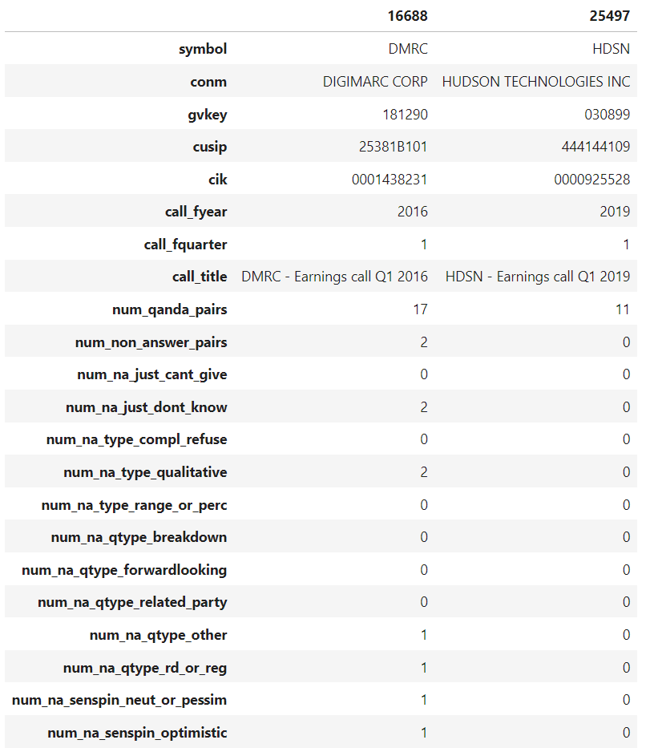

## Companion repository for:

*de Kok, T. (2025). ChatGPT for textual analysis? How to use generative LLMs in accounting research. Management Science.*

Paper link: [SSRN](https://papers.ssrn.com/sol3/papers.cfm?abstract_id=4429658) - [Management Science](https://pubsonline.informs.org/doi/10.1287/mnsc.2023.03253)

## Table of contents

- **1. Online Appendix**
    - [SSRN](https://papers.ssrn.com/sol3/papers.cfm?abstract_id=4429658)
- **2. Code examples**
    - [OpenAI API - zero-shot with ChatGPT/GPT-4](/code_examples/openai/zero_shot.ipynb)
    - [OpenAI API - fine-tuning](/code_examples/openai/fine_tuning.ipynb)
    - [OpenAI API - ChatGPT/GPT-4 speed optimization](/code_examples/openai/batch_processing.ipynb)
    - [Replicate - zero-shot with LlaMa2 70b](/code_examples/replicate/zero_shot.ipynb)
    - [Vast.AI + Huggingface - zero-shot](/code_examples/vast_ai/zero_shot.ipynb)
    - [Runpod.ai + LlaMA-Factory + Deepspeed - fine-tuning](/code_examples/runpod/finetune.ipynb)
    - [Runpod.ai + VLLM -> Fast Inference](/code_examples/runpod/fast_inference.ipynb)
- **3. Paper dataset**
    - Available in the `datasets` folder, see description below.
- **4. Full paper code**
    - [Supplemental Material](https://pubsonline.informs.org/doi/suppl/10.1287/mnsc.2023.03253)

## Dataset description

**Notes**
- Located in the `datasets` folder, available as `.dta` or `.parquet`. 
- Every row represents an earnings call, keyed by `symbol`, `call_fyear`, and `call_fquarter`.
- Identifiers beyond `symbol` are provided for convenience, but only on an as-is basis (they are not used in the paper). 

**Screenshot of dataset**

**The columns map to Appendix A.2 (Non-answer dimensions) in the following way**

| Dimension | Outcome | Column Name in Dataset |
|-----------|----------|-------------------|
| Justification | Cannot give | num_na_just_cant_give |
| Justification | Do not know | num_na_just_dont_know |
| Non-answer type | Complete refusal | num_na_type_compl_refuse |
| Non-answer type | Qualitative | num_na_type_qualitative |
| Non-answer type | Range or percentage | num_na_type_range_or_perc |
| Question type | Breakdown | num_na_qtype_breakdown |
| Question type | Forward-looking | num_na_qtype_forwardlooking |
| Question type | Related party | num_na_qtype_related_party |
| Question type | R&D or regulation | num_na_qtype_rd_or_reg |
| Question type | Other | num_na_qtype_other |
| Sentiment spin | Optimistic | num_na_senspin_optimistic |
| Sentiment spin | Neutral or pessimistic | num_na_senspin_neut_or_pessim |